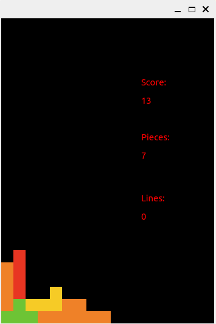
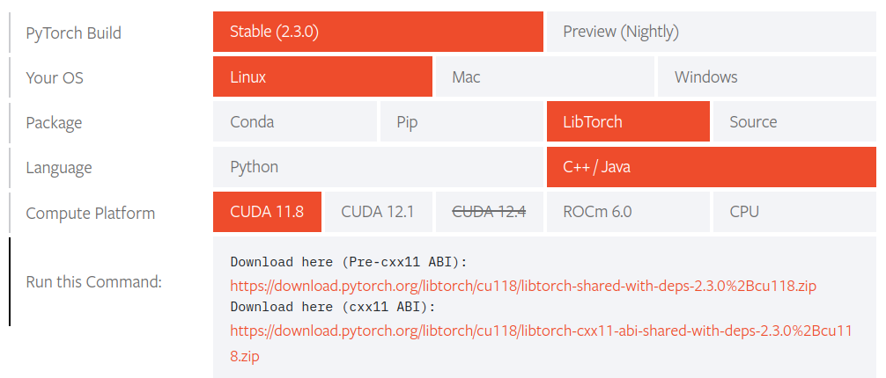

# TetrisForAI
> AI操纵的俄罗斯方块游戏，使用`Libtorch`和`QT`进行开发

 

---

# Run Directly

```bash
# AI操控
./test
# 游玩俄罗斯方块
./tetris
# 训练过程 
./train
```

---

# Build

## Libtorch



需到[Libtorch官网](https://pytorch.org/get-started/locally/)下载已编译的库（pre-cxx11 ABI版本）并放在`src`目录下

## QT

```bash
sudo apt install qt5-default
sudo apt install qtcreator qt5-doc qt5-doc-html qtbase5-doc-html qtbase5-examples
```

> 如果无法编译，请修改CmakeList.txt文件以确保成功链接了您电脑上的库；最糟糕的情况，请直接运行编译好的二进制文件来查看结果

# Thanks

- 首先感谢用于参考的Github项目作者们无私的开源精神（[Tetris](https://github.com/terroo/tetris)，[Tetris-deep-Q-learning-pytorch](https://github.com/uvipen/Tetris-deep-Q-learning-pytorch)）

- 其次，特别感谢在本项目初中期遇到与SFML库链接问题时提供亲切且持续帮助的王雪平老师（复旦）
- 最后，感谢杨志雄同学为可视化贡献的部分代码和文件，他基于easyX开发的图形化接口（`src/darw.cpp`），提供了很有价值的参考
