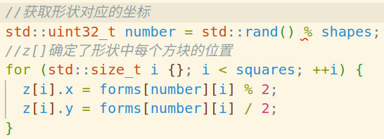
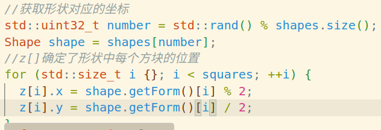
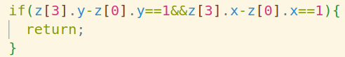
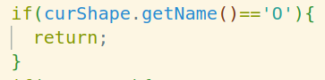
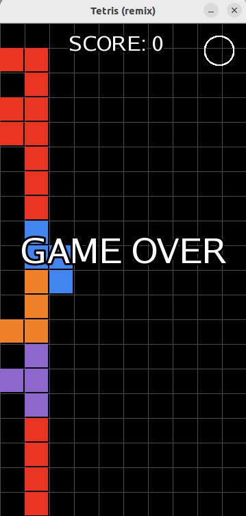
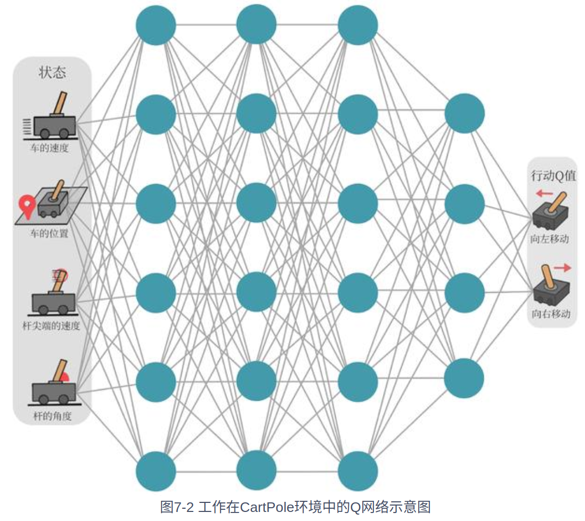
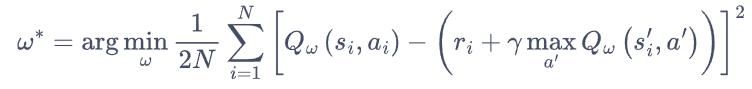

# 基于Libtorch开发的AI俄罗斯方块

## 项目

代码已经发布在github中：https://github.com/songsi1111/TetrisForAI-Libtorch-C-

请参考[README.md](README.md)来了解本项目的结构

## 评分

基本要求

- 程序可正常运行（使用`./test`以运行）
- 成功实现了AI自动化运行Tetris游戏的目标，缺点是损失函数定义不佳，网络训练效果较一般
  - 正常情况AI可自动消除50-150行左右

- 自写代码：约800行，项目总代码量约1100行
  - 用于参考的[Tetris](https://github.com/terroo/tetris, https://github.com/Kofybrek/Tetris)项目，实现了基本的游戏类`Tetris`，代码约300行（非自写）
  - 在`Tetris`类中进行可读性调整，宏命名修复以及增加reset函数，约50行
  - 在`train.hpp、train.cpp`中实现游戏到模型训练的接口类`TetrisForAI`，约300行
  - 定义训练用的深度Q网络`DQN`类，50行
  - 在`train.cpp`中定义`train()`函数，用于进行模型的训练，是最为关键的代码，约150行
  - 在`qt.cpp qtDraw.hpp`中定义可视化类`TetrisWidget`，这部分难度大，代码有些凌乱，代码150行
  - 在`test.cpp`中进行模型数据利用并进行可视化，代码70行

稳定性

- 因为程序体量的原因，关于程序的稳定性确实不够卓越，但是并无大的漏洞

游戏和创意

- 观察AI的游戏行为

界面美观

- 没有大的瑕疵。
- 称不上美观，但是比较简约

> 项目优点在于代码风格不错，分成了不同的类执行不同的功能，但是缺点在于项目中留下了许多值得改进的问题

## Tetris类

### 新增Shape类

为了方便地识别当前下落的方块是什么，我们需要新定义`Shape`类

- 原程序中并没有识别名称的方式，而是直接获得了形状对应的坐标

```cpp
struct Shape{
  Shape(const char& name, const std::vector<uint32_t>& form) : _name(name), _form(form) {}
  char getName() const { return _name; }
  std::vector<u_int32_t> getForm() const { return _form; }
private:
  char _name;             // 形状名称
  std::vector<uint32_t> _form;      // 形状元组数据
};
using Shapes=std::vector<Shape>;
Shapes shapes={
    {'I',{1,3,5,7}}, // I
    {'Z',{2,4,5,7}}, // Z
    {'S',{3,5,4,6}}, // S
    {'T',{3,5,4,7}}, // T
    {'L',{2,5,3,7}}, // L
    {'J',{3,5,7,6}}, // J
    {'O',{2,3,4,5}}, // O
};
```

#### 获取形状的坐标





#### 判断是否是方块：取消方块的旋转





从更改前后的代码对比可以看出，代码的可读性显然提高了

### 新增Reset按钮（已废弃）

reset()函数的简单实现

1. 设置初始化参数
2. 清空画布
3. 重新运行run()函数

```cpp
void Tetris::reset(){
  dirx = score = {0};
  rotate = gameover = {false};
  timercount = {0.f};
  delay = {0.3f};

  UpdateNewShape();
  //清零area
  for(auto&sub:area){
    std::fill(sub.begin(), sub.end(), 0);
  }
  run();
}
```

设置按钮格式（透明白边圆形按钮）

```cpp
Button.setRadius(20);
Button.setPosition(300.f, 20.f);
Button.setFillColor(sf::Color::Transparent);
Button.setOutlineThickness(2.5);               // 设置边框厚度
Button.setOutlineColor(sf::Color::White);      // 设置边框颜色
```

效果：



## TetrisForAI类

本类实现了AI训练需要的一些接口，比较重要的函数有

- `get_holes()`：获取图中的空洞数量

- ` get_bumpiness_and_height() `：获取图的凸起度和总高度

- `Tetris::setScore()`：消除行的函数，可以返回消除的行数

- `get_state_prperties()`：调用如上的函数获取一个状态`State`四元组{lines_cleared,holes,bumpiness,height}

  ```cpp
  using State=torch::Tensor;
  State state = torch::tensor({lines_cleared,holes,bumpiness,height},torch::kFloat32);
  ```

- `get_next_states()`：采取所有可能的行动`Action`进行游戏，并返回所有可能的下一状态`next_states`

  - Action由旋转次数`rotations`和x坐标偏移`biasx`组成

  - 通过一个map返回，这样可以通过Action映射到State

    ```cpp
    using Mapping=std::map<Action,State>;
    ```

- `step(Action& action)`：根据给出的动作单步进行游戏

  - `setRotate()`：进行旋转
  - 旋转后方块上移到顶部
  - 进行横向偏移

还定义了一些结构

```cpp
using State=torch::Tensor;
using Action=std::pair<int,int>;//可能的动作：旋转次数、X坐标
using Mapping=std::map<Action,State>;
struct Exp {
  public:
    State state;
    int reward;
    State next_state;
    bool done;
  public:
    Exp(State s,int r,State n_s,bool d){state=s;reward=r;next_state=n_s;done=d;}
};
using ReplayBuffer=std::vector<Exp>;//经验池：state, reward, next_state, done
```

- 其中`ReplayBuffer`结构是训练中积累的经验池
- 一份经验由{当前状态`state`，即时回报`reward`，下一状态`next_state`，游戏结束标志`done`}组成

还定义了训练网络中的参数

```cpp
static const float learning_rate = 1e-3;
static const int replaybuffer_maxsize=30000;
static const int batch_size=512;
static const int epochs=5000;
static const int decay_epochs=4000;
static const float initial_epsilon = 1;
static const float final_epsilon = 1e-3;
static const float _gamma=0.99;
static const char* save_path = "trained_models";
static const int save_interval = 1000;
```

- 学习率`learning_rate`：取一个比较小的值，决定更新步长
- 利用率`eplison`：决定当前的策略是随机游戏还是选择价值更高的状态
- `_gamma`：折扣因子，衡量未来奖励的重要性

## DQN类

继承自`torch::nn::Module`类

定义了一个三层神经网络4-64-1，由状态四元组映射到一个一元值，层间采用线型层`torch::nn::Linear`和relu激活函数`torch::relu`

比较重要的是保存和加载方法，如果不定义合适的方法无法正确保存训练模型

```cpp
// 实现保存和加载方法
void save(const std::string& file_path) {
    torch::save(this->conv1, file_path + "_conv1.pt");
    torch::save(this->conv2, file_path + "_conv2.pt");
    torch::save(this->conv3, file_path + "_conv3.pt");
}

void load(const std::string& file_path) {
    torch::load(this->conv1, file_path + "_conv1.pt");
    torch::load(this->conv2, file_path + "_conv2.pt");
    torch::load(this->conv3, file_path + "_conv3.pt");
}
```

### Q-learning算法

$Q(s_t,a_t)\leftarrow Q(s_t,a_t)+\alpha[r_t+\gamma max_aQ(s_{t+1,}a)-Q(s_t,a_t)]$

- Q-价值
- s-状态，a-动作
- alpha-学习率，控制更新的步长
- gamma-折扣因子，衡量未来奖励的重要性
- max-选取最优预期奖励
- r-即时奖励

根据当前状态 s_t 下采取动作 a_t 所获得的即时奖励 R_t，以及在下一状态 s_{t+1} 中选择最优动作所得到的预期奖励 max_a Q(s_{t+1}, a)，通过学习率 α 和折扣因子 γ 的调节，更新当前状态下的动作值函数 Q(s_t, a_t) 的估计值。

学习目标是$r+\gamma max_aQ(s',a)$

>在实际应用中，需要适当调整学习率和探索策略，以平衡探索和利用之间的权衡，并确保算法能够收敛到合理的 Q 值估计。

### 基于价值还是基于策略

基于价值的方法（如Q-learning）适用于具有离散状态和动作空间的问题，可以通过学习状态-动作值函数（Q值函数）来指导决策。在俄罗斯方块游戏中，可以将每个游戏状态视为一个状态，每个可能的移动动作视为一个动作，然后使用Q-learning等算法学习状态-动作值函数，从而找到最优的移动策略。这种方法对于探索复杂的状态空间和动作空间并学习最优策略具有一定的优势，但需要合理设计状态表示和动作集合，并且在高维连续状态空间的情况下可能面临维度灾难的挑战。

基于策略的方法（如策略梯度方法）直接学习策略函数，通过梯度上升法更新策略参数，以最大化累积回报。在俄罗斯方块游戏中，可以设计一个策略网络，输入当前游戏状态，输出移动的概率分布，然后使用策略梯度方法进行训练。这种方法可以直接处理连续状态空间和动作空间，无需显式的值函数估计，且可以灵活地学习复杂的策略。然而，策略梯度方法通常需要更多的样本和更新迭代次数才能收敛，且容易陷入局部最优。

### DQN网络

状态值是连续的，动作值是离散的

神经网络具有强大的表达能力，因此我们可以用一个神经网络来表示函数Q

神经网络的输入是状态和动作，然后输出一个标量，表示在状态s下采取动作a能获得的价值

我们还可以只将状态输入到神经网络中，使其同时输出每一个动作的Q值

DQN只能处理动作离散的情况，因为max_a Q



### 损失函数



### 经验回放

维护一个**回放缓冲区**，将每次从环境中采样得到的四元组数据（状态、动作、奖励、下一状态）存储到回放缓冲区中，训练 Q 网络的时候再从回放缓冲区中随机采样若干数据来进行训练

### 目标网络

采用目标网络和训练网络两套Q网络

- 训练网络在训练中的每一步都会更新
- 目标网络的参数每隔C步才与训练网络同步一次

## Train

这一部分的网络定义和训练方法参考[Tetris-deep-Q-learning-pytorch](https://github.com/uvipen/Tetris-deep-Q-learning-pytorch)项目，主要的工作是实现pytorch代码到等价libtorch的转换

- 单步游戏通过`get_next_states()`和`step()`进行，并将下一状态组`next_states`折叠为张量`next_states_tensor`用于模型训练

- 每次将`Exp`四元组添加到经验回放池中

  ```cpp
  auto game_result=env.step(action);
  auto reward=game_result.first;
  auto done=game_result.second;
  
  //if(replaybuffer.size()<replaybuffer_maxsize)
  replaybuffer.push_back(Exp(state, reward, next_state, done));
  ```

- 当经验池大小大于`replaybuffer_maxsize/10`时开始采样批次数据`ReplayBuffer batch`用于训练

  ```cpp
  ReplayBuffer batch;//对经验的采样
  //随机采样
  std::sample(replaybuffer.begin(), replaybuffer.end(), std::back_inserter(batch), batch_size, gen);
  //将批次数据进行处理
  std::vector<State> state_batch;
  std::vector<torch::Tensor> reward_batch;
  std::vector<State> next_state_batch;
  std::vector<bool> done_batch;
  for(const auto&e:batch){
      state_batch.emplace_back(e.state);
      reward_batch.emplace_back(torch::tensor(e.reward));
      next_state_batch.emplace_back(e.next_state);
      done_batch.emplace_back(e.done);
  }
  auto state_batch_tensor=torch::stack(state_batch);
  //转换为列向量
  auto reward_batch_tensor=torch::stack(reward_batch).unsqueeze(1);
  auto next_state_batch_tensor=torch::stack(next_state_batch);
  ```

- 前向传播获得当前状态q值

  ```cpp
  auto q_values=model->forward(state_batch_tensor);
  ```

- 根据学习公式$Q(s_t,a_t)\leftarrow Q(s_t,a_t)+\alpha[r_t+\gamma max_aQ(s_{t+1,}a)-Q(s_t,a_t)]$，计算y值

  ```cpp
  std::vector<torch::Tensor> y_batch_data;
  for (int i = 0; i < reward_batch.size(); i++) {
      if (done_batch[i]) {
          y_batch_data.push_back(reward_batch_tensor[i]);
      } else {
          y_batch_data.push_back(reward_batch_tensor[i] + (_gamma * next_prediction_batch[i].max()));
      }
  }
  
  torch::Tensor y_batch = torch::stack(y_batch_data);//.unsqueeze(1);
  y_batch = y_batch.view_as(q_values);
  ```

- 基于损失函数进行反向传播训练网络

  ```cpp
  optimizer.zero_grad();
  torch::Tensor loss=criterion(q_values,y_batch);
  loss.backward();
  optimizer.step();
  ```

- 输出训练信息，保存训练模型

  ```cpp
  std::cout << "Epoch: " << epoch << "/" << epochs << ", Action: " << action << ", Score: " << final_score
             << ", Tetrominoes: " << final_shapes << ", Cleared lines: " << final_lines <<", Loss: " << loss.item<float>()<< std::endl;
  model->save(save_path + std::string("/tetris"));
  ```

## TetrisWidget类

继承自`QWidget`类，主要函数

- `load_pics()`：用于加载图片资源
- `draw()`：用于绘制界面
- `updateState()`：接受从游戏类传来的参数并`draw()`

该部分参考了杨智雄同学提供的[draw.cpp](src/draw.cpp)代码，该代码风格十分值得学习，可惜ubuntu无法使用easyX图形库

## Test

加载模型，使用前向传播获得最有价值的动作进行游戏，并调用TetrisWidget类进行图形化界面绘制

具体代码参考[test.cpp](src/test.cpp)，个人认为该代码也很值得一看
